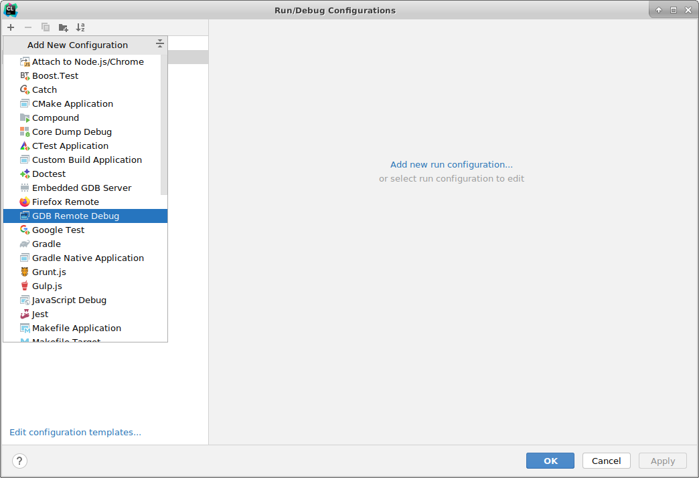
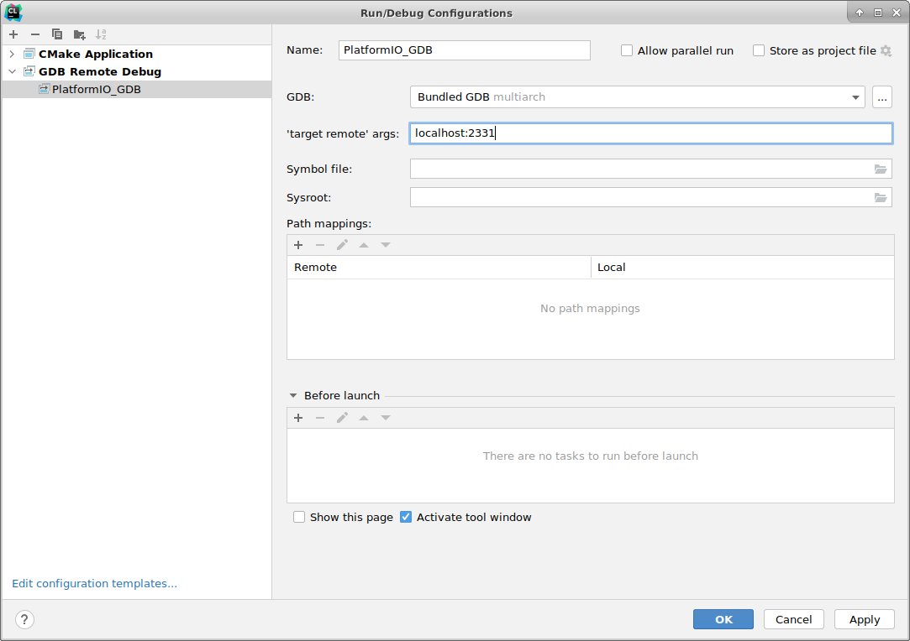
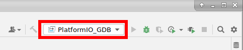
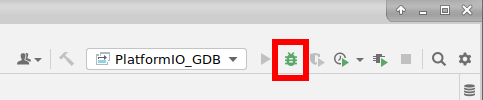
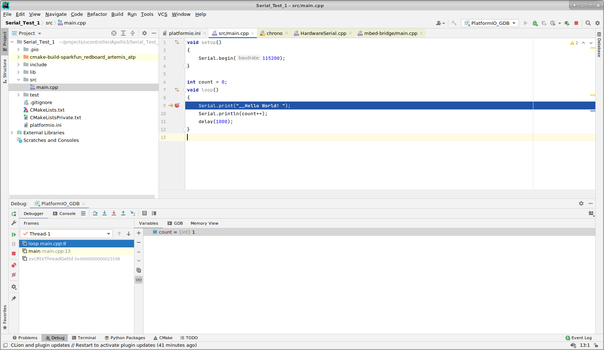

# Clion Debugging

After starting `platformio debug --interface=gdb -x .pioinit` ([see here](../UsingSeggerJLink.md#debug-firmware))

In the Run/Debug Configurations window add a new GDB Remote Debug configuration:

1. Update the run configuration's name `Platform_IO` has been used in this example
2. Fill in the `'target remote' args` with `localhost:2331`
3. Select the compiled program in the `Symbol file:` field. It is typically in `.pio/build/<ENV_NAME>/program`, where in out `playformio.ini` file above we have `[env:SparkFun_RedBoard_Artemis_ATP]` so we would have `.pio/build/SparkFun_RedBoard_Artemis_ATP/program`.
4. Press the `Apply` button and the the `OK` button.
5. Select our newly created run configuration:  
6. Attach the debugger by pressing the debug button: 
7. Now we are debugging: 
