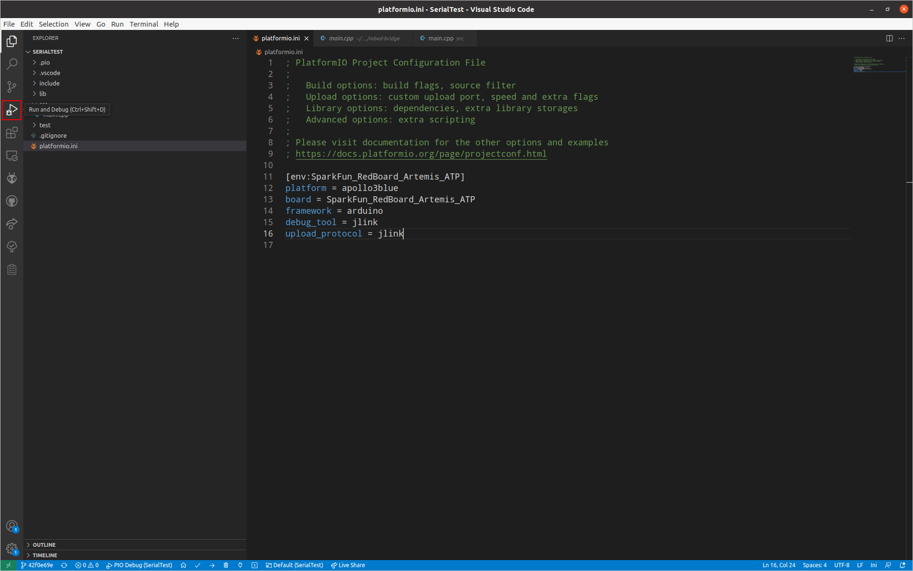
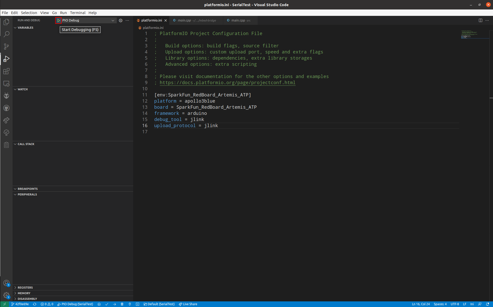
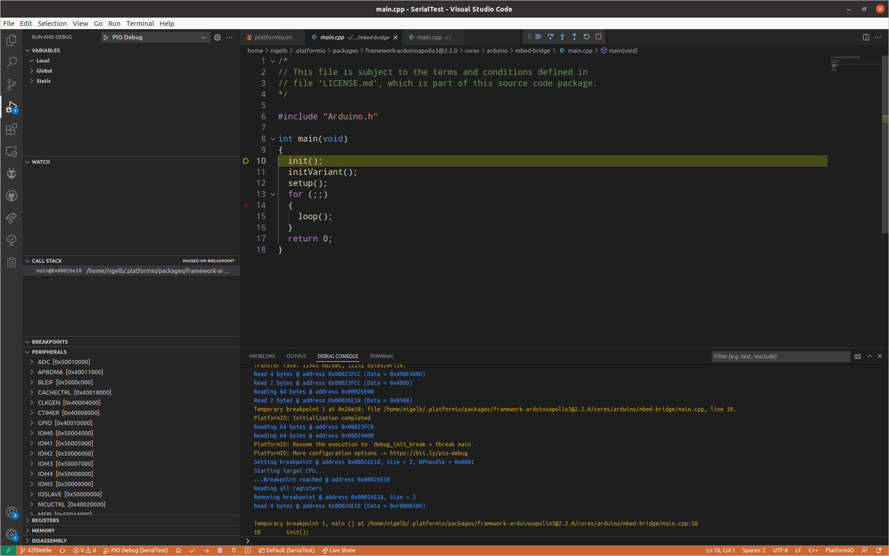

# VSCode Debugging
Once you have added the `debug_tool` directive to your `platformio.ini` ([see here](../UsingSeggerJLink.md#debug-firmware)) file we are ready to debug:

 1. Select `Run and Debug` from the Activity Bar:
    

 2. Press the `Start Debugging` button:
    

 3. You are now Debuging
    